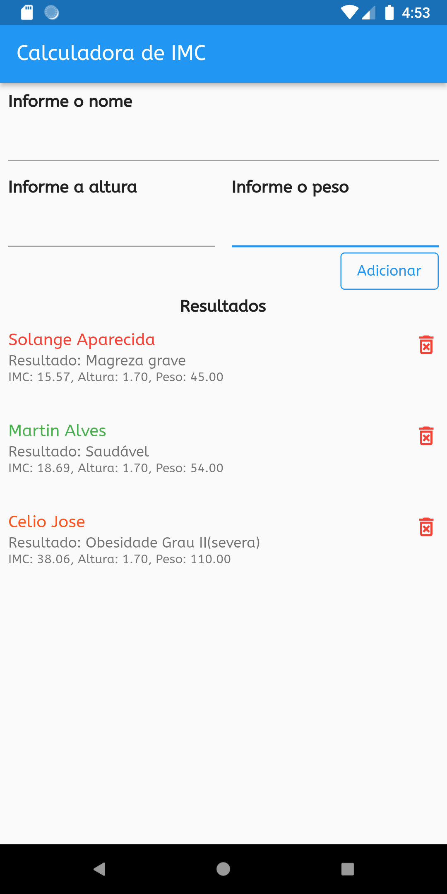
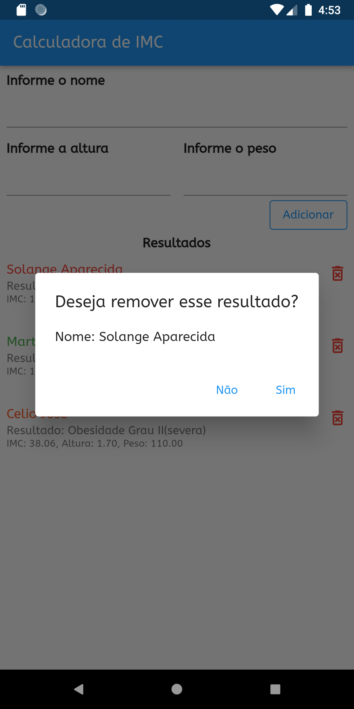

# Cálculadora IMC

App desenvolvido em Flutter para calcular o IMC.

Segue alguns prints do app:

Aqui é tela do principal do app onde é adicionado os dados da pessoa.

Nessa imagem é mostrado o resultado de algumas pessoas, quando o IMC está ok fica na cor verde, caso cotrário muda para a cor laranga e nos casos grave muda para vermelho.

Foi implementado a opção de excluir.

